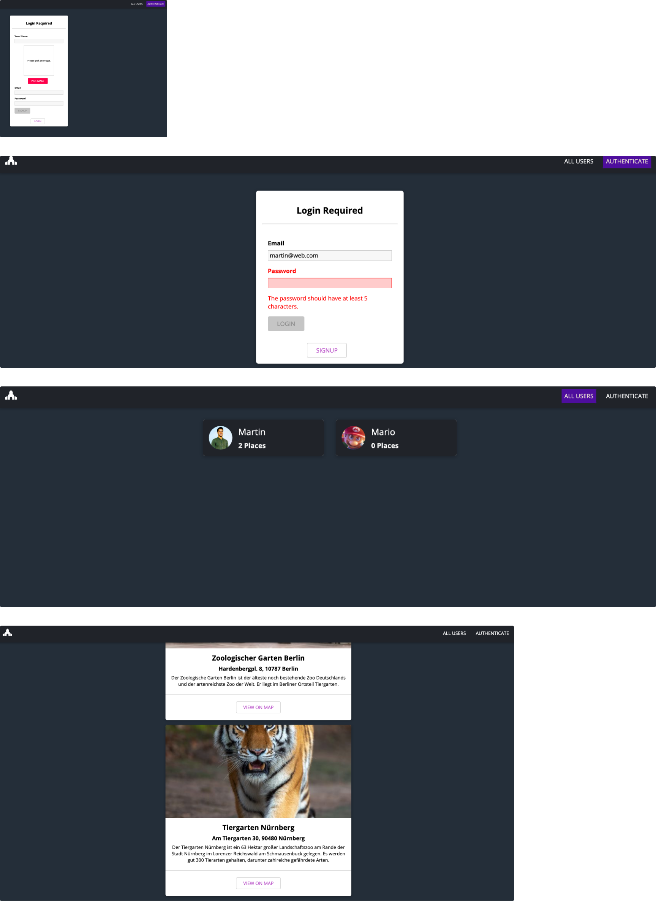

# mern-stack-app

# About the App

### Introduction:
This repository showcases a Fullstack Application using the MERN Stack. 

### Notes:
- the application is a Fullstack web application making use of all **CRUD** operations
- the technology stack used to build the application is the **MERN Stack**, which stands for MongoDB, Express.js, React.js, and Node.js
---
- **MongoDB** is a NoSQL database that provides a flexible schema design and scalability for data storage
- **Express.js** is a popular backend web framework for Node.js, used for building APIs and web applications
- **React.js** is a popular frontend JavaScript library for building user interfaces
- **Node.js** is a JavaScript runtime that allows developers to run JavaScript on the server side

#### Hint: The MERN Stack is a popular technology stack for building web applications due to its flexibility, scalability, and ease of use.

### Functionality:
- the user can create a profile with their own avatar
- the user has the option to log in or logout
- the user has the option to create a place + add an image and the address using Google Maps API
- the user can delete or update their places
- the user can view the places of other users

### Technology:
- the created user password is hashed using the popular library called bcrypt
- the session of a user is given by a JSON Web Token which expires after 1 hour
- a place created by a user is connected in the MongoDB Database via the Object-ID of a user and their place
- the Backend Server covers all use cases for potential errors (i.e. wrong address, trying to delete a place from a different user via POST Request, Authentication Errors, etc.)

# Preview

